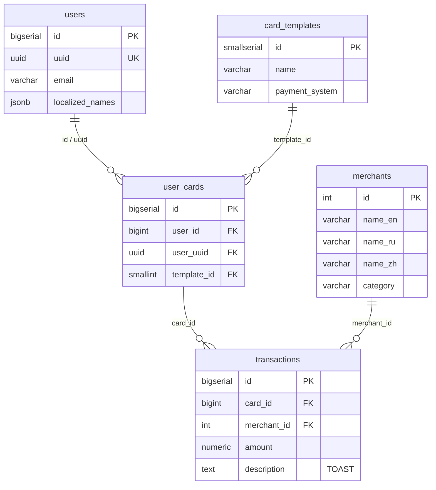

# Your PostgreSQL Is an F1 Car. Stop Driving in First Gear
## Part 1: Introduction and Environment Setup

## What This Series Is About

Picture this: you're writing a Java backend. Your app talks to PostgreSQL via Hibernate. Everything flies on staging, flies on production with a hundred users. Then a million users show up, and everything grinds to a halt. Queries that used to finish in 10 ms now hang for 5 seconds.

Most of the time, the problem isn't Java or Hibernate. The problem is **how your data is stored and how you access it**. Until you understand what PostgreSQL is doing under the hood, you'll be fighting symptoms instead of root causes.

In this series, we'll dissect how PostgreSQL executes queries, why some are fast and others aren't, and how this knowledge helps you write performant applications. No dry theory — everything is hands-on.

---

## What We'll Build

We'll build a training database — a payment system with users, cards, merchants, and transactions. We'll spin up **two PostgreSQL instances**: one with a modest amount of data (like a staging environment) and another with millions of rows (like production). Running the same queries against both will reveal how database behavior changes as data scales.

In this part — setting the stage:
1. Spin up PostgreSQL in Docker
2. Get to know the schema
3. Populate the databases with test data

---

## Spinning Up PostgreSQL in Docker

Everything you need is in the `docker/` folder of the [repository](https://github.com/YuryKlimchuk/article-postgresql-tuning).

### What's Inside

```
docker/
├── .env                  # Configuration
├── docker-compose.yml    # Two PostgreSQL containers
├── schema.sql            # DDL: tables, indexes, comments
├── data-small.sql        # Small DB seed data
└── data-large.sql        # Large DB seed data
```

### docker-compose.yml

Two PostgreSQL 16 containers based on Alpine. Full file — in the [repository](https://github.com/YuryKlimchuk/article-postgresql-tuning/blob/master/docker/docker-compose.yml).

Note: we enable the `pg_stat_statements` extension — it'll come in handy in later parts for query performance analysis.

### Starting Up

```bash
cd docker
docker compose up -d
```

The first run creates both containers, runs DDL scripts, and populates them with test data. **The large DB will take a few minutes** — it's generating 5 million transactions.

Verify everything is up:

```bash
docker compose ps
# You should see two containers with status "healthy"
```

Connect to the small DB (port 5434):

```bash
docker exec -it pg_tuning_small psql -U postgres -d payment_small
```

Connect to the large DB (port 5433):

```bash
docker exec -it pg_tuning_large psql -U postgres -d payment_large
```

---

## Database Schema

Our system is a simplified model of a payment service. Five tables:



*Full DDL: [schema.sql](https://github.com/YuryKlimchuk/article-postgresql-tuning/blob/master/docker/schema.sql)*

Some things may look odd — don't worry, they're intentional for learning purposes.

### users

Users have **two identifiers** — a numeric `id` (BIGSERIAL) and a `uuid`. This is by design: in a later part we'll compare JOIN performance across different foreign key types.

The `localized_names` field uses **JSONB** — one of two localization approaches in our schema.

### card_templates

A lookup table of bank products. 30 templates total. Note the `CHAR(3)` — we'll discuss why `VARCHAR` is almost always a better choice in future parts.

### user_cards

**Two foreign keys to users** — the central teaching element of the schema. `user_id` references the numeric primary key, `user_uuid` references the UUID. We'll JOIN via each and measure the difference.

### merchants

The second localization approach: **separate columns per language** (`name_en`, `name_ru`, `name_zh`) instead of JSONB. Each approach has its trade-offs — to be discussed in later parts.

### transactions

The `description` field of type `TEXT` is populated with "heavy" data (`repeat('Lorem ipsum...', N)`). This is a teaching device to demonstrate:

- **TOAST** — PostgreSQL's mechanism for storing oversized values outside the table page
- Why `SELECT *` is a bad idea (it pulls TOAST values you don't need)
- The speed difference between `SELECT *` and `SELECT id, amount` on millions of rows

---

## Two Data Volumes

Same schema, different scale:

| Table | Small DB | Large DB |
|-------|----------|----------|
| `card_templates` | 30 | 30 |
| `merchants` | 100 | 100 |
| `users` | 1,000 | 500,000 |
| `user_cards` | 2,000 | 1,000,000 |
| `transactions` | ~50,000 | ~5,000,000 |

The small DB mimics a staging environment — queries are instant, plans are simple, problems are invisible. The large DB shows production reality — and that's where things get interesting.

---

## What's Next

In the next part, we'll fire up our first queries. We'll learn to read `EXPLAIN ANALYZE` and watch PostgreSQL search for data: sequential scans, bitmap scans, index scans, and index-only scans. We'll see with our own eyes how the same query behaves completely differently on 50 thousand rows vs 5 million.

> **Note:** The Mermaid diagram above renders automatically on GitHub/GitLab. For Medium, export it as SVG via [mermaid.live](https://mermaid.live).

---

*Questions and feedback — in the comments. Source files — in the [repository](https://github.com/YuryKlimchuk/article-postgresql-tuning).*
