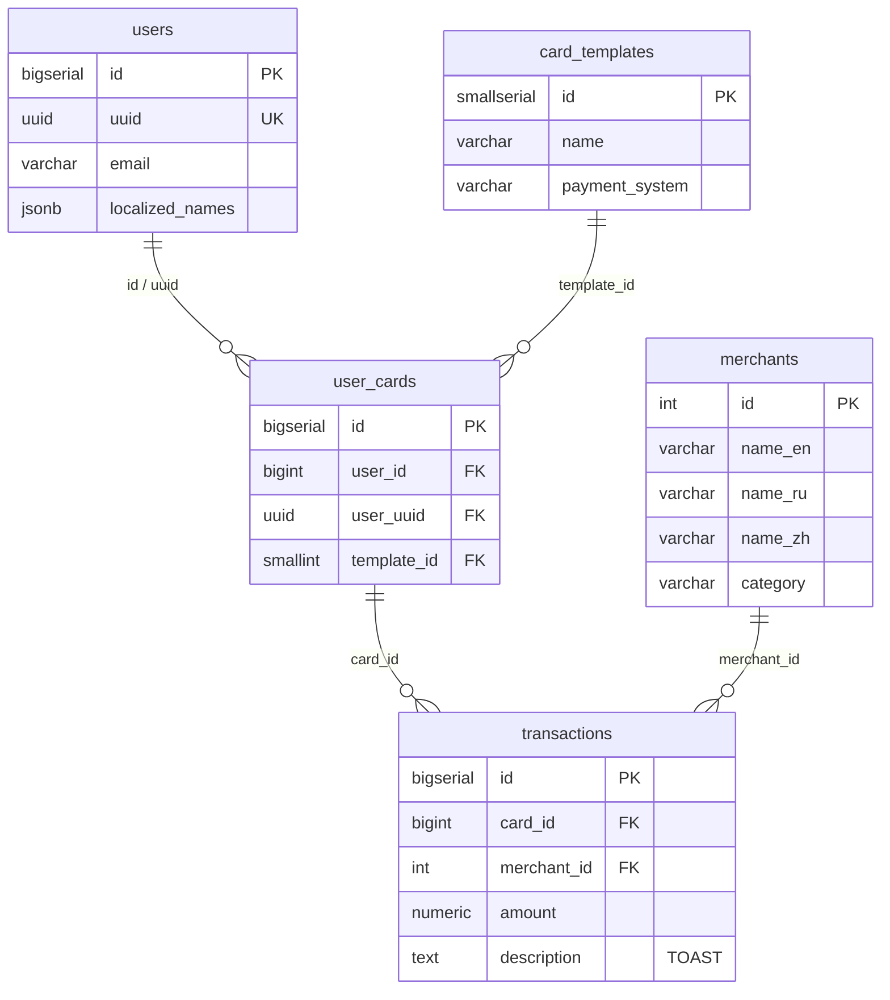

# Твой PostgreSQL — это болид F1. Хватит ездить на первой передаче
## Часть 1: Введение и настройка окружения

## О чём эта серия

Представьте: вы пишете бэкенд на Java. Приложение работает с PostgreSQL через Hibernate. На тестовом окружении всё летает, на проде с сотней пользователей — тоже. А потом приходит миллион пользователей, и всё встаёт колом. Запросы, которые раньше отрабатывали за 10 мс, начинают висеть по 5 секунд.

Чаще всего проблема не в Java и не в Hibernate. Проблема в том, **как данные лежат в базе и как мы к ним обращаемся**. И пока вы не понимаете, что происходит под капотом PostgreSQL, вы будете бороться с симптомами, а не с причиной.

В этой серии статей мы разберём, как PostgreSQL выполняет запросы, почему одни запросы работают быстро, а другие — нет, и как это знание помогает писать производительные приложения. Никакой голой теории — всё можно повторить своими руками.

---

## Что будем делать

Мы построим учебную базу данных — платёжную систему с пользователями, картами, мерчантами и транзакциями. Поднимем **два экземпляра PostgreSQL**: один с небольшим объёмом данных (как на тестовом окружении), второй — с миллионами записей (как на проде). На одних и тех же запросах увидим, как меняется поведение базы данных при росте объёмов.

В этой части — подготовка стенда:
1. Поднимем PostgreSQL в Docker
2. Познакомимся со схемой данных
3. Наполним базы тестовыми данными

---

## Поднимаем PostgreSQL в Docker

Весь код для запуска лежит в [репозитории](https://github.com/YuryKlimchuk/article-postgresql-tuning) в папке `docker/`.

### Что внутри

```
docker/
├── .env                  # Конфиг
├── docker-compose.yml    # Конфигурация: два контейнера PostgreSQL
├── schema.sql            # DDL: таблицы, индексы, комментарии
├── data-small.sql        # Наполнение малой БД
└── data-large.sql        # Наполнение большой БД
```

### docker-compose.yml

Два контейнера PostgreSQL 16 на базе Alpine. Полный файл — [в репозитории](https://github.com/.../blob/main/docker/docker-compose.yml).

Обратите внимание: мы включаем расширение `pg_stat_statements` — оно понадобится в следующих частях для анализа производительности запросов.

### Запуск

```bash
cd docker
docker compose up -d
```

Первый запуск создаст оба контейнера, выполнит DDL-скрипты и наполнит БД тестовыми данными. **Большая БД будет наполняться несколько минут** — это нормально, генерируется 5 миллионов транзакций.

Проверяем, что всё поднялось:

```bash
docker compose ps
# Должны увидеть два контейнера со статусом healthy
```

Подключаемся к малой БД (порт 5434):

```bash
docker exec -it pg_tuning_small psql -U postgres -d payment_small
```

Подключаемся к большой БД (порт 5433):

```bash
docker exec -it pg_tuning_large psql -U postgres -d payment_large
```

---

## Схема базы данных

Наша система — упрощённая модель платёжного сервиса. Пять таблиц:



*Полный DDL: [schema.sql](https://github.com/.../blob/main/docker/schema.sql)*

Некоторые вещи могут вам показаться странными, но не переживайте, это сделано умышленно в учебных целях.

### users — пользователи

У пользователя **два идентификатора** — числовой `id` (BIGSERIAL) и `uuid`. Это сделано специально, чтобы сравнить скорость JOIN-ов по разным типам внешних ключей.

Поле `localized_names` использует **JSONB** — один из двух подходов к хранению локализованных данных, который мы увидим в схеме.

### card_templates — шаблоны карт

Справочник банковских продуктов. Всего 30 шаблонов. Обратите внимание на `CHAR(3)` — в следующих частях обсудим, почему `VARCHAR` почти всегда предпочтительнее.

### user_cards — карты пользователей

**Два внешних ключа на users** — это центральный учебный элемент схемы. `user_id` ссылается на числовой первичный ключ, `user_uuid` — на UUID. Мы будем делать JOIN по каждому из них и сравнивать разницу.

### merchants — мерчанты

Второй подход к локализации: **отдельные колонки под каждый язык** (`name_en`, `name_ru`, `name_zh`) вместо JSONB. У каждого подхода свои плюсы и минусы — обсудим в следующих частях.

### transactions — транзакции

Поле `description` типа `TEXT` заполняется «тяжёлыми» данными (`repeat('Lorem ipsum...', N)`). Это учебный приём, чтобы продемонстрировать:

- **TOAST** — механизм PostgreSQL для хранения больших значений вне страницы таблицы
- Почему `SELECT *` — плохая идея (тянет TOAST-значения, которые вам не нужны)
- Разницу в скорости между `SELECT *` и `SELECT id, amount` на миллионах строк

---

## Два объёма данных

Одна и та же схема, но разные масштабы:

| Таблица | Малая БД | Большая БД |
|---------|----------|------------|
| `card_templates` | 30 | 30 |
| `merchants` | 100 | 100 |
| `users` | 1 000 | 500 000 |
| `user_cards` | 2 000 | 1 000 000 |
| `transactions` | ~50 000 | ~5 000 000 |

Малая БД имитирует тестовое окружение — запросы выполняются мгновенно, планы запросов простые, проблемы не видны. Большая БД показывает реальность продакшена — и именно здесь начинается самое интересное.

---

## Что дальше

В следующей части мы возьмём нашу БД и запустим первые запросы. Научимся читать `EXPLAIN ANALYZE` и посмотрим, как PostgreSQL ищет данные: последовательное сканирование, битовая карта, индексный поиск и покрывающие индексы. Увидим своими глазами, как один и тот же запрос на 50 тысячах строк и на 5 миллионах строк ведёт себя совершенно по-разному.